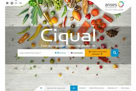

# ANSES Ciqual MCP Server

<div align="center">

[](https://github.com/zzgael/ciqual-mcp/actions/workflows/tests.yml)
[](https://badge.fury.io/py/ciqual-mcp)
[](https://www.python.org/downloads/)
[](https://opensource.org/licenses/MIT)
[](https://modelcontextprotocol.io/)

An MCP (Model Context Protocol) server providing SQL access to the ANSES Ciqual French food composition database. Query nutritional data for over 3,000 foods with full-text search support.



</div>

## Features

- 🍎 **Comprehensive Database**: Access nutritional data for 3,185+ French foods
- 🔍 **SQL Interface**: Query using standard SQL with full flexibility
- 🌍 **Bilingual Support**: French and English food names
- 🔤 **Fuzzy Search**: Built-in full-text search with typo tolerance
- 📊 **60+ Nutrients**: Detailed composition including vitamins, minerals, macros, and more
- 🔄 **Auto-Updates**: Automatically refreshes data yearly from ANSES (checks on startup)
- 🔒 **Read-Only**: Safe queries with no risk of data modification
- 💾 **Lightweight**: ~10MB SQLite database with efficient indexing

## Installation

### Via pip
```bash
pip install ciqual-mcp
```

### Via uvx (recommended)
```bash
uvx ciqual-mcp
```

### From source
```bash
git clone https://github.com/zzgael/ciqual-mcp.git
cd ciqual-mcp
pip install -e .
```

## MCP Client Configuration

### Claude Desktop

Add to your Claude Desktop configuration:

**macOS**: `~/Library/Application Support/Claude/claude_desktop_config.json`  
**Windows**: `%APPDATA%/Claude/claude_desktop_config.json`  
**Linux**: `~/.config/Claude/claude_desktop_config.json`

```json
{
  "mcpServers": {
    "ciqual": {
      "command": "uvx",
      "args": ["ciqual-mcp"]
    }
  }
}
```

### Zed

Add to your Zed settings:

```json
{
  "assistant": {
    "version": "2",
    "mcp": {
      "servers": {
        "ciqual": {
          "command": "uvx",
          "args": ["ciqual-mcp"]
        }
      }
    }
  }
}
```

### Cline (VSCode Extension)

Add to your VSCode settings (`settings.json`):

```json
{
  "cline.mcpServers": {
    "ciqual": {
      "command": "uvx",
      "args": ["ciqual-mcp"]
    }
  }
}
```

### Continue.dev

Add to your Continue config (`~/.continue/config.json`):

```json
{
  "mcpServers": [
    {
      "name": "ciqual",
      "command": "uvx",
      "args": ["ciqual-mcp"]
    }
  ]
}
```

## Usage

### As an MCP Server

The server implements the Model Context Protocol and exposes a single `query` function:

```bash
# Start the server standalone (for testing)
ciqual-mcp
```

### Direct Python Usage

```python
from ciqual_mcp.data_loader import initialize_database

# Initialize/update the database
initialize_database()

# Then use SQLite directly
import sqlite3
conn = sqlite3.connect("~/.ciqual/ciqual.db")
cursor = conn.execute("SELECT * FROM foods WHERE alim_nom_eng LIKE '%apple%'")
```

## Database Schema

### Tables

#### `foods` - Food items
- `alim_code` (INTEGER, PK): Unique food identifier
- `alim_nom_fr` (TEXT): French name
- `alim_nom_eng` (TEXT): English name
- `alim_grp_code` (TEXT): Food group code

#### `nutrients` - Nutrient definitions
- `const_code` (INTEGER, PK): Unique nutrient identifier
- `const_nom_fr` (TEXT): French name
- `const_nom_eng` (TEXT): English name
- `unit` (TEXT): Measurement unit (g/100g, mg/100g, etc.)

#### `composition` - Nutritional values
- `alim_code` (INTEGER): Food identifier
- `const_code` (INTEGER): Nutrient identifier
- `teneur` (REAL): Value per 100g
- `code_confiance` (TEXT): Confidence level (A/B/C/D)

#### `foods_fts` - Full-text search
Virtual table for fuzzy matching with French/English names

### Common Nutrient Codes

| Category | Code | Nutrient | Unit |
|----------|------|----------|------|
| **Energy** | 327 | Energy | kJ/100g |
| | 328 | Energy | kcal/100g |
| **Macros** | 25000 | Protein | g/100g |
| | 31000 | Carbohydrates | g/100g |
| | 40000 | Fat | g/100g |
| | 34100 | Fiber | g/100g |
| | 32000 | Sugars | g/100g |
| **Minerals** | 10110 | Sodium | mg/100g |
| | 10200 | Calcium | mg/100g |
| | 10260 | Iron | mg/100g |
| | 10190 | Potassium | mg/100g |
| **Vitamins** | 55400 | Vitamin C | mg/100g |
| | 56400 | Vitamin D | µg/100g |
| | 51330 | Vitamin B12 | µg/100g |

## Example Queries

### Basic Search
```sql
-- Find foods by name
SELECT * FROM foods WHERE alim_nom_eng LIKE '%orange%';

-- Fuzzy search (handles typos)
SELECT * FROM foods_fts WHERE foods_fts MATCH 'orang*';
```

### Nutritional Queries
```sql
-- Get vitamin C content for oranges
SELECT f.alim_nom_eng, c.teneur as vitamin_c_mg
FROM foods f
JOIN composition c ON f.alim_code = c.alim_code
WHERE f.alim_nom_eng LIKE '%orange%' 
  AND c.const_code = 55400;

-- Find foods highest in protein
SELECT f.alim_nom_eng, c.teneur as protein_g
FROM foods f
JOIN composition c ON f.alim_code = c.alim_code
WHERE c.const_code = 25000
ORDER BY c.teneur DESC
LIMIT 10;

-- Compare macros for different foods
SELECT 
    f.alim_nom_eng as food,
    MAX(CASE WHEN c.const_code = 25000 THEN c.teneur END) as protein_g,
    MAX(CASE WHEN c.const_code = 31000 THEN c.teneur END) as carbs_g,
    MAX(CASE WHEN c.const_code = 40000 THEN c.teneur END) as fat_g,
    MAX(CASE WHEN c.const_code = 328 THEN c.teneur END) as calories_kcal
FROM foods f
JOIN composition c ON f.alim_code = c.alim_code
WHERE f.alim_nom_eng IN ('Apple, raw', 'Banana, raw', 'Orange, raw')
  AND c.const_code IN (25000, 31000, 40000, 328)
GROUP BY f.alim_code, f.alim_nom_eng;
```

### Dietary Restrictions
```sql
-- Find low-sodium foods (<100mg/100g)
SELECT f.alim_nom_eng, c.teneur as sodium_mg
FROM foods f
JOIN composition c ON f.alim_code = c.alim_code
WHERE c.const_code = 10110 
  AND c.teneur < 100
ORDER BY c.teneur ASC;

-- High-fiber foods (>5g/100g)
SELECT f.alim_nom_eng, c.teneur as fiber_g
FROM foods f
JOIN composition c ON f.alim_code = c.alim_code
WHERE c.const_code = 34100 
  AND c.teneur > 5
ORDER BY c.teneur DESC;
```

## Data Source

Data is sourced from the official ANSES Ciqual database:
- Website: https://ciqual.anses.fr/
- Data portal: https://www.data.gouv.fr/fr/datasets/table-de-composition-nutritionnelle-des-aliments-ciqual/

The database is automatically updated yearly when the server starts (data hasn't changed since 2020, so yearly updates are sufficient).

## Requirements

- Python 3.9 or higher
- 50MB free disk space (for database)
- Internet connection (for initial data download)

## License

MIT License - See LICENSE file for details

## Contributing

Contributions are welcome! Please feel free to submit a Pull Request.

## Development

### Running Tests

```bash
# Install development dependencies
pip install -e .
pip install pytest pytest-asyncio

# Run unit tests
python -m pytest tests/test_server.py -v

# Run functional tests (requires database)
python -m pytest tests/test_functional.py -v
```


## Troubleshooting

### Database not initializing
- Check internet connection
- Ensure write permissions to `~/.ciqual/` directory
- Try manual initialization: `python -m ciqual_mcp.data_loader`

### XML parsing errors
- The tool handles malformed XML automatically with recovery mode
- If issues persist, delete `~/.ciqual/ciqual.db` and restart

## Credits

Developed by **Gael Debost** as part of a multi-LLM interface for medical research developed by [Ideagency](https://ideagency.fr).

Data provided by ANSES (Agence nationale de sécurité sanitaire de l'alimentation, de l'environnement et du travail).

## Citation

If you use this tool in your research, please cite:

```bibtex
@software{ciqual_mcp,
  title = {ANSES Ciqual MCP Server},
  author = {Gael Debost},
  year = {2025},
  url = {https://github.com/zzgael/ciqual-mcp}
}
```